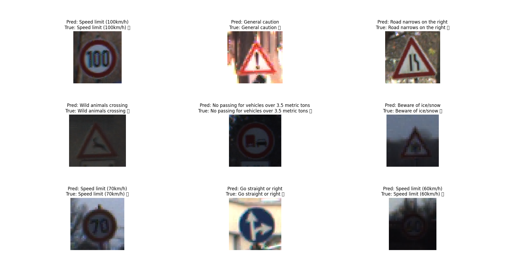
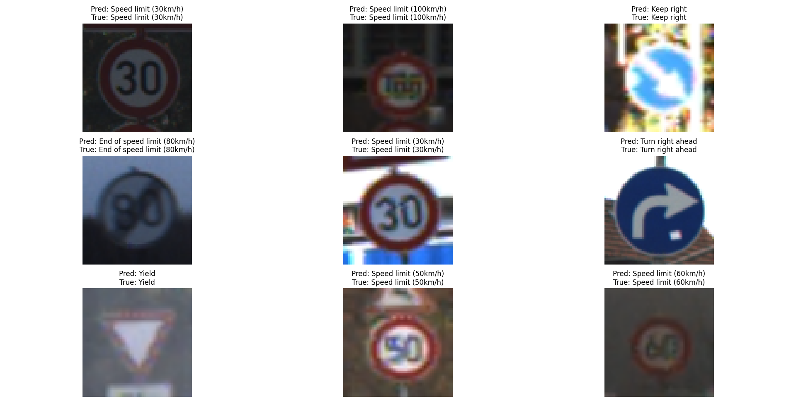

# Traffic Sign Recognition with CNN (GTSRB)

Deep learning project that classifies German traffic signs into 43 categories using a convolutional neural network, built during my internship at [Elevvo Pathways](https://www.linkedin.com/company/elevvopaths/).

## Dataset

**GTSRB — German Traffic Sign Recognition Benchmark**, 43 classes covering speed limits, warnings, prohibitions, and mandatory signs.

> The dataset itself isn't included in this repo (too large for GitHub). Download it from [Kaggle — GTSRB](https://www.kaggle.com/datasets/meowmeowmeowmeowmeow/gtsrb-german-traffic-sign?select=Train) or the [official benchmark site](https://benchmark.ini.rub.de/gtsrb_news.html), then place it under `data/GTSRB/` (or update `data_dir` in the script to point wherever you keep it).

## Objective

Build a CNN that reliably recognizes traffic signs from real-world (cropped) images — a core computer vision task for autonomous driving and driver-assistance systems.

## Approach

1. **Data loading & cleaning** — parsed `Train.csv` / `Test.csv`, resolved image paths, filtered missing files.
2. **Preprocessing** — resized all images to 64×64, rescaled pixel values, split off a 10% stratified validation set.
3. **Augmentation** — random rotation, zoom, contrast, and translation applied at training time to improve generalization.
4. **Model** — a 4-block CNN (Conv2D → BatchNorm → MaxPooling, filters 32→64→128→256), followed by global average pooling, dropout, and a dense softmax output over 43 classes.
5. **Training** — Adam optimizer, sparse categorical crossentropy, with `ReduceLROnPlateau` and `EarlyStopping` callbacks (best weights restored via `ModelCheckpoint`).
6. **Evaluation** — confusion matrix, per-class classification report, and accuracy/loss curves.
7. **Robustness check** — re-ran predictions on the test set using an OpenCV-based preprocessing pipeline (instead of the TensorFlow one) to confirm the model performs consistently regardless of how images are loaded.

## Results

**Test accuracy: 97.47%** 

### Validation Predictions (TensorFlow pipeline)



Sample of 9 validation images with predicted vs. true labels — all correctly classified, including visually similar speed-limit signs (30 vs. 100 km/h) and low-contrast/dark images.

### Test Predictions (OpenCV pipeline)



Same model, but images preprocessed via OpenCV (`cv2.imread` → BGR-to-RGB → resize) instead of the TensorFlow decode pipeline. Predictions remain accurate across all 9 samples, confirming the model isn't overfit to one specific image-loading pipeline.

### Training Curves

Training vs. validation accuracy/loss tracked across epochs, with early stopping restoring the best-performing weights.


## key Takeaways

- A relatively compact CNN (4 conv blocks) reaches **97.47% test accuracy** on 43 classes when paired with batch normalization, dropout, and data augmentation — architecture depth matters less than good regularization here.
- The model generalizes across preprocessing pipelines (TensorFlow vs. OpenCV), which matters for real-world deployment where the inference pipeline may differ from training.
- Data augmentation (rotation, zoom, contrast, translation) was key to handling the variability in sign angle, lighting, and image quality seen in the GTSRB test images.

## Tools

Python · TensorFlow/Keras · OpenCV · Pandas · NumPy · Scikit-learn · Matplotlib · Seaborn

## Repo Structure

```
├── data/
│   └── GTSRB/                    # not included — see Dataset section above
├── GTSRB.py                      # full training & evaluation pipeline
├── tf_predictions.png
├── opencv_predictions.png
├── training_curves.png
├── requirements.txt
└── README.md
```

## Run it yourself

```bash
pip install -r requirements.txt
python GTSRB.py
```
